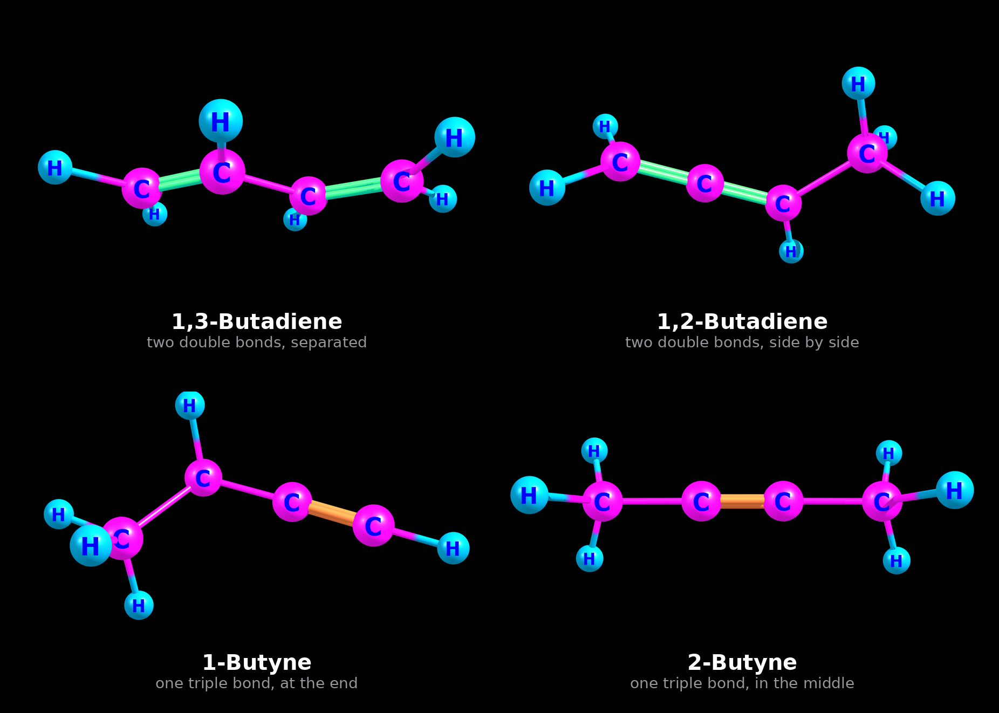
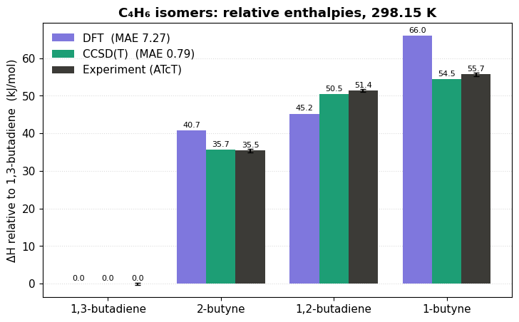

# C₄H₆ Isomer Thermochemistry: DFT vs CCSD(T) vs Experiment

How well do DFT and CCSD(T) match experiment? Tested on the four C₄H₆ isomers:
**1,3-butadiene, 1,2-butadiene, 1-butyne, and 2-butyne**.

  

  <i>The four C₄H₆ isomers, optimized at B3LYP-D4/def2-TZVP. Green = double bond, orange = triple bond.</i>

## Objective

To test whether DFT and CCSD(T) reproduce measured enthalpies of formation. Reference values come from ATcT (Active Thermochemical Tables), built entirely from experimental data. The comparison shows how much each method deviates and whether it can be trusted.

## Target result

## Results

**Comparison of calculated versus experimental relative enthalpies for C₄H₆ isomers, in kJ/mol**

| Isomer | $\Delta E_{DFT} + \Delta(H - E_{el,DFT})$ | $\Delta E_{CCSD(T)} + \Delta(H - E_{el,DFT})$ | $\Delta H_{Exp.}$ | Error DFT | Error CCSD(T) |
|---|---|---|---|---|---|
| 1,3-Butadiene | 0.00 | 0.00 | 0.00 ± 0.29 | 0.00 | 0.00 |
| 2-Butyne | 40.72 | 35.72 | 35.46 ± 0.45 | +5.26 | +0.26 |
| 1,2-Butadiene | 45.23 | 50.49 | 51.40 ± 0.42 | −6.17 | −0.91 |
| 1-Butyne | 66.05 | 54.47 | 55.68 ± 0.56 | +10.37 | −1.21 |

*Relative enthalpies, kJ/mol, 298.15 K, gas phase. Experimental values from ATcT v1.220, relative to 1,3-butadiene (absolute ΔfH°: 111.15, 146.61, 162.55, 166.83 kJ/mol).*

  

<i>CCSD(T) matches experiment closely; DFT deviates by 5 to 10 kJ/mol.</i>

## Conclusion

Both methods put the four isomers in the same order, and that order matches experiment. Where they differ is accuracy: DFT is off by 5 to 10 kJ/mol while CCSD(T) is off by about 1, and the only thing that changed between them is the electronic energy.

## Files

<b>ORCA input files</b>

| Isomer | Geometry + frequencies (DFT) | Single point (CCSD(T)) |
|---|---|---|
| 1,3-Butadiene | [butadiene13.inp](inputs/butadiene13.inp) | [butadiene13ccsd.inp](inputs/butadiene13ccsd.inp) |
| 1,2-Butadiene | [butediene12.inp](inputs/butediene12.inp) | [butediene12ccsd.inp](inputs/butediene12ccsd.inp) |
| 1-Butyne | [butyne1.inp](inputs/butyne1.inp) | [butyne1ccsd.inp](inputs/butyne1ccsd.inp) |
| 2-Butyne | [butyne2.inp](inputs/butyne2.inp) | [butyne2ccsd.inp](inputs/butyne2ccsd.inp) |

<b>ORCA output files</b>

| Isomer | DFT | CCSD(T) |
|---|---|---|
| 1,3-Butadiene | [butadiene13.out](outputs/butadiene13.out) | [butadiene13ccsd.out](outputs/butadiene13ccsd.out) |
| 1,2-Butadiene | [butediene12.out](outputs/butediene12.out) | [butediene12ccsd.out](outputs/butediene12ccsd.out) |
| 1-Butyne | [butyne1.out](outputs/butyne1.out) | [butyne1ccsd.out](outputs/butyne1ccsd.out) |
| 2-Butyne | [butyne2.out](outputs/butyne2.out) | [butyne2ccsd.out](outputs/butyne2ccsd.out) |

© 2026 Handson Gisubizo. All rights reserved. No part of this work may be used, reproduced, or distributed without written permission.
